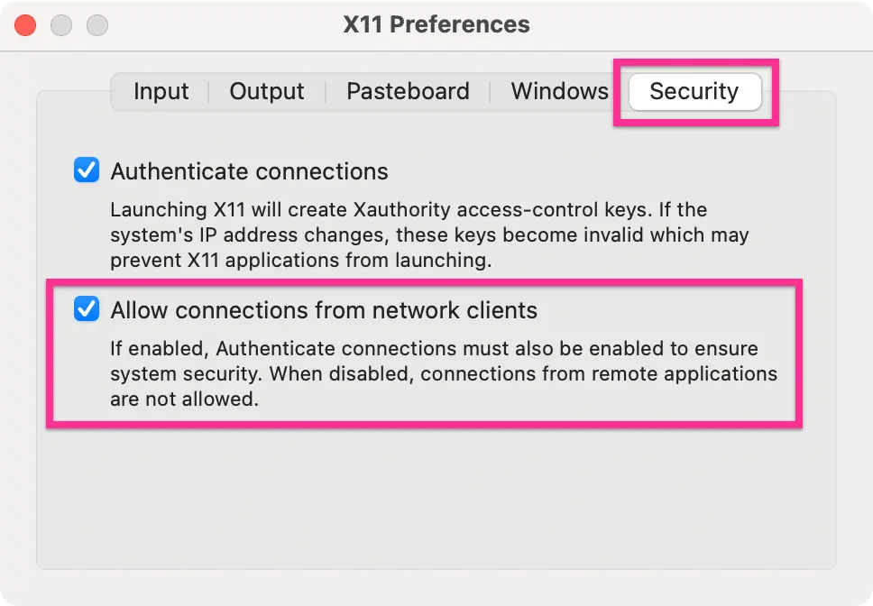

Follow the installation instructions from the [Docker website](
https://docs.docker.com/engine/install/) for your operating system. Once the
Docker service is running, you can verify it with:

```bash
docker info

# or
docker version
```

## Working with Images

### Listing images

```bash
docker image ls
```

### Pulling images

You can pull an image from Docker Hub before running it:

```bash
docker pull ubuntu:latest
```

Alternatively, `docker run` will pull the image automatically if it is not
already available locally.

### Running an image

```bash
docker run -ti ubuntu:latest bash
docker run <image-id>
```

`-ti` stands for terminal interactive.

### Saving an image from a container

To save the current state of a container as a new image:

```bash
docker commit <container-id>
```

You can also assign a name at the same time:

```bash
docker commit <container-id> <image-name>
```

To tag an existing image with a name:

```bash
docker tag <SHA-256-image-id> <my-image-name>
```

### Deleting images

```bash
docker rmi <image-name>
```

Delete all dangling images:

```bash
docker rmi $(docker images --filter "dangling=true" -q)
```


## Managing Containers

### Listing containers

```bash
# running containers
docker ps

# all containers
docker ps -a

# last exited container
docker ps -l
```

### Running a detached container

Start a container in the background with the `-d` flag:

```bash
docker run -d -ti ubuntu:latest bash
```

Attach to a running detached container:

```bash
docker attach <container-name-or-id>
```

To exit a container without killing the process, press
<kbd>Ctrl</kbd>+<kbd>P</kbd> followed by <kbd>Ctrl</kbd>+<kbd>Q</kbd>.

### Run and remove on exit

To automatically remove a container when it exits:

```bash
docker run --rm <image-name>
```

### Accessing a running container's shell

```bash
docker exec -it <container-id> bash
```

### Stopping containers

Stop a specific container:

```bash
docker kill <container-id>
```

Stop all running containers:

```bash
docker stop $(docker ps -a -q)
```

### Deleting containers

Delete a specific container:

```bash
docker rm <id-or-name>
```

Delete all idle containers:

```bash
docker container prune -a
```


## Networking

### Using the host network

```bash
docker run -it --net=host centos bash
```

### Port forwarding

Map a host port to a container port with `-p`:

```bash
docker run -ti -p 8888:8888 -v ${PWD}:/home jupyter bash
```

### Setting a MAC address

```bash
docker run -it --mac-address 02:42:ac:11:0d:11 ubuntu bash
docker run -ti --rm --mac-address $(printf '02:42:ac:%02X:%02X:%02X' $[RANDOM%256] $[RANDOM%256] $[RANDOM%256]) ubuntu bash
```


## Volumes & Environment Variables

### Sharing volumes

You can share a folder between the host and the container using `-v`:

```bash
docker run -v /home/host/docs:/home -ti centos bash
docker run -v ${PWD}:/home -ti ubuntu bash
```

### Passing environment variables

Use the `-e` flag to pass environment variables. Multiple `-e` flags are
supported:

```bash
docker run -ti -e LANG=C.UTF-8 -e TZ=Asia/Singapore ubuntu bash
```


## Cleanup & Storage Management

### Checking Docker storage usage

```bash
docker system df
```

### Removing build cache

```bash
docker builder prune
docker builder prune -fa
```

### Cleaning up volumes

```bash
docker volume prune -a
docker volume prune -af  # force, no confirmation guard
```

### Reclaiming space immediately

After a cleanup operation, storage space may take several minutes to reflect.
To reclaim it immediately:

```bash
docker run --privileged --pid=host --rm docker/desktop-reclaim-space
```

### Full system prune

Delete all stopped containers and images:

```bash
docker system prune -a
```


## Running GUI Apps on Docker

To run GUI applications inside Docker, you need an X window system. On Linux,
X11 is available natively. On macOS, install [XQuartz](https://www.xquartz.org),
and on Windows install [Xming](https://sourceforge.net/projects/xming/).

On macOS, allow connections from network clients in XQuartz preferences:



After launching XQuartz (you can launch it from the terminal with
`open -a XQuartz`), run `xhost +` or `xhost + 127.0.0.1`. More about the X
window system [here](https://developer.ibm.com/tutorials/l-lpic1-106-1/).

```bash
# macOS
docker run --rm -tid -e DISPLAY=docker.for.mac.host.internal:0 ubuntu firefox

# Linux
docker run --rm -tid --net=host -e DISPLAY=:0 ubuntu firefox

# Windows
docker run --rm -tid -e DISPLAY=host.docker.internal:0 ubuntu firefox
```

This assumes the X version of Firefox is installed in the Ubuntu image.


## Running Apache on Docker

Pull the CentOS image:

```bash
docker pull centos
```

Run and enter the container:

```bash
docker run -ti centos bash
```

Once inside, update the OS and install Apache:

```bash
sudo dnf install httpd
```

Commit the container and start Apache:

```bash
docker commit <container-id> centos
docker run --net=host centos httpd -D FOREGROUND &
```

Browsing your host IP address should now show the default Apache page. To
stop the server, kill the container:

```bash
docker ps
docker kill <container-id>
```


## Dockerfile

Below is an example `Dockerfile`:

```docker
# Start from Ubuntu 22.04 LTS
FROM ubuntu:jammy

# Update OS
RUN apt update \
 && apt upgrade -y

# Install software packages
RUN apt install -y python3 \
 && apt install -y python3-pip \
 && apt install -y git \
 && apt install -y fonts-open-sans

# Install pip packages
RUN pip3 install jupyterlab numpy scipy matplotlib

# bashrc settings
RUN echo 'alias jupyter-notebook="jupyter-notebook --allow-root --no-browser"' \
      >> $HOME/.bashrc

# Clone code from git repository
WORKDIR /root
RUN git clone https://github.com/pranabdas/arpespythontools.git

# Leave in `/home` which we can map with the host
WORKDIR /home
```

Build the image (assuming the file is named `Dockerfile`):

```bash
docker build -t arptools .
```

If the file has a different name:

```bash
docker build -t arptools -f arptools.dockerfile .
```

Launch the container:

```bash
docker run -ti --net=host -v /host/path:/home arptools bash
```

### Adding a non-root user

Basic example:

```docker
RUN groupadd -r noroot && useradd -r -g noroot noroot

# Make owner of certain directory / executables
RUN chown -R noroot:noroot build_dir

# Set user
USER noroot
```

More detailed example using `adduser` (also check `useradd --help`):

```docker
ENV NON_ROOT_USER="noroot"
ENV NON_ROOT_USER_GROUP="noroot"
ARG NON_ROOT_USER_PASSWORD="SECRET-PASSWORD"

RUN groupadd -r $NON_ROOT_USER_GROUP -g 1000 \
  && useradd \
    --uid 1000 \
    --system \
    --gid $NON_ROOT_USER_GROUP \
    --create-home \
    --home-dir /home/$NON_ROOT_USER/ \
    --shell /bin/bash \
    --comment "non-root user" \
    $NON_ROOT_USER \
  && chmod 755 /home/$NON_ROOT_USER/ \
  && echo "$NON_ROOT_USER:$NON_ROOT_USER_PASSWORD" | chpasswd

USER $NON_ROOT_USER
```

:::tip

Running `chown` on a large directory may increase the image size significantly.
In such cases, build the directory using another instance and copy it to the
new image using:

```bash
COPY --chown=noroot:noroot /home/build_dir /noroot/build_dir
```

:::


## Docker Compose

Docker Compose helps create, run, and manage the lifecycle of containers. For
example, the following `docker run` command:

```bash
docker run -d --name apache -p 8080:80 \
  -v ${PWD}/build:/usr/local/apache2/htdocs/ httpd:latest
```

translates to the following Compose specification:

```yml title="compose.yaml"
services:
  apache:
    image: httpd:latest
    container_name: apache
    ports:
      - '8080:80'
    volumes:
      - ./build:/usr/local/apache2/htdocs
```

Navigate to the directory containing `compose.yaml` and run:

```bash
docker compose up
```

The website will be accessible at `localhost:8080`. To run in the background,
use the `-d` (detached) flag:

```bash
docker compose up -d
```

To force a rebuild containers before starting:

```bash
docker compose up -d --build
```

To stop or tear down services (`down` stops the container and removes it,
whereas `stop` only stops it):

```bash
docker compose stop
docker compose down
```

Restart a specific container:

```bash
docker compose restart <container-name>
```

Explore all available Compose commands with:

```bash
docker compose --help
```

### Accessing a container shell

List running containers, then exec into the one you need:

```bash
docker ps
docker ps -a
docker exec -it <container-id> bash
```

### Cleanup with Compose

Remove all images (works even when containers are not running):

```bash
docker compose down --rmi all
```

Remove volumes together with images:

```bash
docker compose down --rmi all -v
```

Remove only locally built images, leaving remotely pulled images (e.g.,
`nginx`) intact:

```bash
docker compose down --rmi local
```

Remove only volumes:

```bash
docker volume prune -fa
```


## Docker Hub/ Container Registry

### Logging in

```bash
docker login docker.io
```

Log in to the GitHub Container Registry using a personal access token:

```bash
echo $CR_PAT | docker login ghcr.io -u pranabdas --password-stdin
```

### Pulling from GHCR

```bash
docker pull ghcr.io/<user-or-org-name>/<image>
docker pull ghcr.io/<user-or-org-name>/<image>:<tag>
```

### Tagging and pushing a local image

```bash
docker tag localimage:latest username/localimage:latest
docker push username/localimage:latest
```


## Transferring an Image Offline

Save an image to a file and load it on another machine:

```bash
docker pull ubuntu
docker save -o ubuntu_image.docker ubuntu
docker load -i ubuntu_image.docker
```


## Using systemctl in Docker

See this project: [docker-systemctl-replacement](
https://github.com/gdraheim/docker-systemctl-replacement).


## References

- [Docker Compose Documentation](https://docs.docker.com/compose/)
