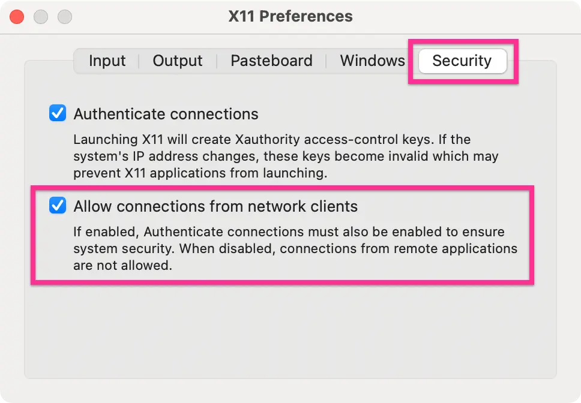

Follow the installation instruction from [Docker website](
https://docs.docker.com/engine/install/) in your system. Once docker service has
started, you can check:
```bash
docker info

# or
docker version
```

List images:
```bash
docker images
```

Run an image:
```bash
docker run -ti ubuntu:latest bash
docker run <image-id>
```
`-ti` stands for terminal interactive. If the image is not present locally, it
will pull from the docker hub. Alternatively, you can use `docker pull` to
download locally an image prior to running.

List docker process:
```bash
# running containers
docker ps

# all containers
docker ps -a

# last exited container
docker ps -l
```

Create images from container:
```bash
docker commit <container-id>
```

Give a name to the image:
```bash
docker tag <SHA-256-image-id> <my-image-name>
```

We can assign name at the same time with commit:
```bash
docker commit <container-id> <image-name>
```
This will save the state of the container in the latest image.

Start a detached container:
```bash
docker run -d -ti ubuntu:latest bash
```

Attach running detached container:
```bash
docker attach <container-name-or-id>
```

Exit from the docker container without killing the process: [control] + [P],
[control] + [Q]

Sharing volumes (shared folder with the host):
```bash
docker run -v /home/host/docs:/home -ti centos bash
docker run -v ${PWD}:/home -ti ubuntu bash
```

Check docker storage usage:
```bash
docker system df
```

Remove build cache:
```bash
docker builder prune
```

Delete container:
```bash
docker rm <id-or-name>
```

Delete all idle containers:
```bash
docker container prune
```

Delete images:
```bash
docker rmi <image-name>
```

Reclaim space immediately (otherwise it may take several minutes to reflect
storage space after a cleanup operation):
```bash
docker run --privileged --pid=host --rm docker/desktop-reclaim-space
```

Delete all the stopped containers and images:
```bash
docker system prune -a
```

Run and remove when docker instance exits:
```bash
docker run --rm <image-name>
```

Use host network:
```bash
docker run -it --net=host centos bash
```

Port forwarding:
```bash
docker run -ti -p 8888:8888 -v ${PWD}:/home jupyter bash
```

Set MAC address:
```bash
docker run -it --mac-address 02:42:ac:11:0d:11 ubuntu bash
```

You can also pass environment variables with `-e` flag, e.g.,`-e LANG=C.UTF-8`,
`-e TZ=Asia/Singapore`. You can pass multiple `-e` flags to pass multiple such
variables.


## Running GUI apps on docker

First we need to install a X-window system. On linux, we can choose X11. On
macOS [X-Quartz](https://www.xquartz.org), on Windows [xming](
https://sourceforge.net/projects/xming/). On macOS, allow connections from
network clients:



After launching XQuartz (you may launch for terminal by `open -a XQuartz`),
issue `xhost +`. More about X-window system [here](
https://developer.ibm.com/tutorials/l-lpic1-106-1/).


```bash
# macOS
docker run --rm -tid -e DISPLAY=docker.for.mac.host.internal:0 ubuntu firefox

# linux
docker run --rm -tid --net=host -e DISPLAY=:0 ubuntu firefox

# Windows
docker run --rm -tid -e DISPLAY=host.docker.internal:0 ubuntu firefox
```

I assumed you have the X version of firefox is installed in the ubuntu image.


## Running apache on docker

Here we will install centos docker image:
```bash
docker pull centos
```

Run docker:
```bash
docker run -ti centos bash
```

Once inside centos update the os:
```bash
dnf up
```

Install apache:
```bash
sudo dnf install httpd
exit
docker commit <container-id> centos
docker run --net=host centos httpd -D FOREGROUND &
```

Now if you browse your host IP address you should be able to view the default
website. We can stop the httpd, by killing the container.
```bash
docker ps
docker kill <container-id>
```

Stop all running containers:

```bash
docker stop $(docker ps -a -q)
```


## Dockerfile

Write the `Dockerfile`:
```docker
# Start from Ubuntu 22.04 LTS
FROM ubuntu:jammy

# Update OS
RUN apt update \
 && apt upgrade -y

# Install software packages
RUN apt install -y python3 \
 && apt install -y python3-pip \
 && apt install -y git \
 && apt install -y fonts-open-sans

# Install pip packages
RUN pip3 install jupyterlab numpy scipy matplotlib

# bashrc settings
RUN echo 'alias jupyter-notebook="jupyter-notebook --allow-root --no-browser"' \
>> $HOME/.bashrc

# clone code from git repository
WORKDIR /root
RUN git clone https://github.com/pranabdas/arpespythontools.git

# leave in `/home` which we can map with the host
WORKDIR /home
```

Build docker image (the file is named Dockerfile):
```bash
docker build -t arptools .
```

If the file is named other than Dockerfile:
```bash
docker build -t arptools -f arptools.dockerfile .
```

Launch:
```bash
docker run -ti --net=host -v /host/path:/home arptools bash
```

Add non-root user and group:
```docker
RUN groupadd -r noroot && useradd -r -g noroot noroot

# make owner of certain directory / executables
RUN chown -R noroot:noroot build_dir

# set user
USER noroot
```

More details on `adduser` (also check `useradd --help`):
```docker
ENV NON_ROOT_USER="noroot"
ARG NON_ROOT_USER_PASSWORD="gf3r-trf5-6etd"
ENV NON_ROOT_USER_GROUP="noroot"

RUN groupadd -r $NON_ROOT_USER_GROUP -g 1000 \
 && useradd \
    --uid 1000 \
    --system \
    --gid $NON_ROOT_USER_GROUP \
    --create-home \
    --home-dir /home/$NON_ROOT_USER/ \
    --shell /bin/bash \
    --comment "non-root user" \
    $NON_ROOT_USER \
 && chmod 755 /home/$NON_ROOT_USER/ \
 && echo "$NON_ROOT_USER:$NON_ROOT_USER_PASSWORD" | chpasswd
```

:::tip

Running `chown` on a large directory may increase the image size significantly.
In such case build the directory using another instance, and copy it to new
image using:
```bash
COPY --chown=noroot:noroot /home/build_dir /noroot/build_dir
```

:::


## Docker hub

Login:
```bash
sudo docker login docker.io
```

Tag a local image:
```bash
sudo docker tag localimage:latest username/localimage:latest
```

Push a local image:
```bash
sudo docker push username/localimage:latest
```


## Transferring image offline

```bash
docker pull ubuntu
docker save -o ubuntu_image.docker ubuntu
docker load -i ubuntu_image.docker
```


## Docker compose

Docker compose can help create, run, and manage the lifecycle of the containers.
For example below docker run command

```bash
docker run -d --name apache -p 8080:80 -v ${PWD}/build:/usr/local/apache2/htdocs/ httpd:latest
```

would translate to following docker compose specification:

```yml title="compose.yaml"
services:
  apache:
    image: httpd:latest
    container_name: apache
    ports:
      - '8080:80'
    volumes:
      - ./build:/usr/local/apache2/htdocs
```

Now go to the directory where `compose.yaml` is saved and issue:

```bash
docker compose up
```

Now we can access our website at `localhost:8080` using a web browser.

We can run a service in the background with `-d` (detached) flag.

```bash
docker compose up -d
```

Once we are done, we can `stop` or `down` (`down` stops the container and
removes the container).

```bash
docker compose stop
docker compose down
```

Explore more docker compose commands with

```bash
docker compose --help
```

How can we access the shell of a container running a service? List running
containers:

```bash
docker ps
```

Then access the shell:

```bash
docker exec -it <container-id> bash
```

## References
- [https://docs.docker.com/compose/](https://docs.docker.com/compose/)
