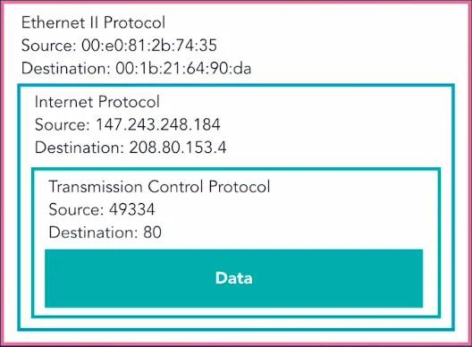

The following information is solely for learning purposes. Test them on a
system / network that you own or have explicit permission to carry out such
tests.

Many building blocks of the internet was not designed with security in mind.
There exists a trove of vulnerabilities not only in the implementation but also
in the formulation. In layer 2 (of 7 layer [OSI model](
https://en.wikipedia.org/wiki/OSI_model)) which includes Wi-Fi and LAN networks
are basically broadcast medium, meaning every packet is available to every other
member of the network. Each device is identified by its MAC address. Once the
ource and destination MAC address matches it moves to the IP (layer 3) layers.
Anyone can turn his/her device's promiscuous mode on, and sniff every packet
passes through the entire network. Later we will use [Wireshark](
https://www.wireshark.org) and see it ourselves.

The defence against sniffing is encryption. A good program (e.g., Signal) always
encrypts the messages end-to-end. A good bank website server will only allow
connection over https. A common misconception is that https is always safe. That
is not true. It only means that the connection between your browser and the
server is made via a secure protocol, and it's hard for the sniffing attackers
to decipher the traffic, however a malicious or vulnerable webserver still could
expose your information, so always be careful which website you visit and trust.

Different layers have their own headers, and many of these headers are visible
to anyone in the network. Luckily, nowadays most of the websites encrypt the
actual data they transport between client and server. However, still it might
reveal a lot of metadata.



## Address Resolution Protocol (ARP)

This is used by the devices in the same LAN or Wi-Fi network to discover each
other. Check the devices' IP address and MAC address mapping in your network:
```bash
arp -a
```

Here we have a possibility of man-in-the-middle attacks. Can you make your
friend's computer believe that you are the router, and make router believe that
you are your friend's computer? Then you sit in the traffic between your
friend's computer and the router. When your friend tries to visit a website,
you send a forged webpage asking to login, once he/she submits username and
password, you get them. In fact, from next step onwards you handover the real
traffic so he/she does not suspect anything. Understand the risk of joining a
public network or where there is possibility of an adversary present in the
network.

Now, let's move on to the next layer, the IP network layer (layer 3). Every
network devices participates in this layer, be it a laptop, phone, router,
server, smart TV, fridge, or even today's hair driers. Every device has its
unique IP address (e.g., 192.29.277.32 or more recent IPv6 addresses
2001:0db8:85a3:0000:0000:8a2e:0370:7334). Traffic flows between one IP address
to another, say your phone running Facebook app and its server in California.
Anyone sits in-between this two end points such as a router, your internet
service provider has the ability to intercept the traffic. So possibility of
man-in-the-middle attack here too. There exists other vulnerabilities too other
than sniffing. It is very easy to change the source IP address in the header (by
design of internet), and this leads to responses send back to wrong address.
This is how DoS attacks are launched. With large number of bogus responses, you
can overload a server and deny access to legitimate connections.

Check if a server is running:
```bash
ping www.example.com
```

Some more details on the server:
```bash
dig www.example.com
```

Trace route the connection path:
```bash
traceroute www.example.com
```
However, it is not guaranteed that `ping` or `traceroute` will always respond.
They rely on ICMP signal, all server is not guaranteed to respond to them.

TCP (layer 4): This layer establishes the reliability of a connection. When a
new connection opens, there is a three-way-handshake to synchronize the
connection. Later on a sequence number is added to every packet, receiver knows
what to expect and makes sure things are in order. For different process in the
client, there is a separate port numbers while the servers uses known ports,
e.g., HTTP uses port 80, HTTPS port 443, SSH port 22. Although
three-way-handshake makes it hard to hijack a connection by IP spoofing, there
is no defence against TCP injection by man-in-the-middle attacker. A
man-in-the-middle can easily see source, destination ports and sequence numbers.

DNS (layer 5): there is a world wide network of servers that translates the
website addresses to IP addresses. Imagine what you could do if you gain access
to the DNS resolution system? An user tries to visit his/her bank website, you
return the IP address of a forged bank website. Currently there is no encryption
used in DNS layer. It is only protected by the TCP/UDP layer encryption
therefore vulnerable to man-in-the-middle position attacks. Remember, last time
you connected to a Wi-Fi network in a restaurant, you tried to visit say
*google.com*, but first it send you a form asking to give you name, phone
number, once you enter, it redirects to intended *google.com* (?). It is even
abused by some authorities with help of ISPs.

## Lynis

Download Lynis [https://cisofy.com/lynis/](https://cisofy.com/lynis/#download).
Un-tar the package:

```bash
tar -zxvf lynis-3.0.0.tar.gz
cd lynis
./lynis audit system
```

## Nmap

```bash
# On Ubuntu
sudo apt install nmap

# On CentOS/RHEL/Fedora
sudo dnf install nmap

# On macOS
brew install nmap
```

Sample scan report:

```bash
$ sudo nmap -Pn ec2-xx-xxx-xx-xx.ap-southeast-1.compute.amazonaws.com
Starting Nmap 7.70 ( https://nmap.org ) at 2020-07-23 10:02 UTC
Nmap scan report for ec2-xx-xxx-xx-xx.ap-southeast-1.compute.amazonaws.com (xx.xxx.xx.xx)
Host is up (0.0000030s latency).
rDNS record for xx.xxx.xx.xx: ip-xx-xxx-xx-xx.ap-southeast-1.compute.internal
Not shown: 997 closed ports
PORT    STATE SERVICE
22/tcp  open  ssh
80/tcp  open  http
443/tcp open  https

Nmap done: 1 IP address (1 host up) scanned in 1.60 seconds
```

By default it scans 1000 ports, there are 65,535 possible ports. If you have
IPv6 addresses, use `-6` flag.

Operating system detection:

```bash
$ nmap -O ec2-xx-xxx-xx-xx.ap-southeast-1.compute.amazonaws.com
Starting Nmap 7.70 ( https://nmap.org ) at 2020-07-23 09:50 UTC
Nmap scan report for ec2-xx-xxx-xx-xx.ap-southeast-1.compute.amazonaws.com (xx.xxx.xx.xx)
Host is up (0.0000030s latency).
rDNS record for xx.xxx.xx.xx: ip-xx-xxx-xx-xx.ap-southeast-1.compute.internal
Not shown: 997 closed ports
PORT    STATE SERVICE
22/tcp  open  ssh
80/tcp  open  http
443/tcp open  https
Device type: general purpose
Running: Linux 3.X
OS CPE: cpe:/o:linux:linux_kernel:3
OS details: Linux 3.7 - 3.10
Network Distance: 0 hops

OS detection performed. Please report any incorrect results at https://nmap.org/submit/ .
Nmap done: 1 IP address (1 host up) scanned in 3.89 seconds
```

Unfortunately, it did not guess correctly the linux version.

Service version detection:

```bash
$ sudo nmap -sV ec2-xx-xxx-xx-xx.ap-southeast-1.compute.amazonaws.com
Starting Nmap 7.70 ( https://nmap.org ) at 2020-07-23 09:58 UTC
Nmap scan report for ec2-xx-xxx-xx-xx.ap-southeast-1.compute.amazonaws.com (xx.xxx.xx.xx)
Host is up (0.0000040s latency).
rDNS record for xx.xxx.xx.xx: ip-xx-xxx-xx-xx.ap-southeast-1.compute.internal
Not shown: 997 closed ports
PORT    STATE SERVICE VERSION
22/tcp  open  ssh     OpenSSH 8.0 (protocol 2.0)
80/tcp  open  http    Apache httpd 2.4.37 ((Red Hat Enterprise Linux) OpenSSL/1.1.1c mod_fcgid/2.3.9)
443/tcp open  ssl/ssl Apache httpd (SSL-only mode)

Service detection performed. Please report any incorrect results at https://nmap.org/submit/ .
Nmap done: 1 IP address (1 host up) scanned in 14.09 seconds
```

This time not only it detected services, it also correctly identified the server Operating system. Scan a single port `-p 80` or the whole range `-p 1-65535`. We can get combine all methods using `-A`.

```bash
sudo nmap -A -v -p 80 ec2-xx-xxx-xx-xx.ap-southeast-1.compute.amazonaws.com
```

## nikto

Nikto is a web vulnerability test utility. If you are on Ubuntu, you can simply install from the package manager.

```bash
sudo apt install nikto
```

If you are on RHEL or CentOS, you need to manually install.

```bash
sudo dnf install perl
git clone https://github.com/sullo/nikto
cd nikto/program
perl nikto.pl -h www.example.com
```

There are additional dependencies for full functionality, please check the nikto
documentation. Here is a sample output on a default apache server on latest
RHEL:

```bash
$ perl nikto.pl -h http://xx.xxx.xx.xx
- Nikto v2.1.6
---------------------------------------------------------------------------
+ Target IP:          xx.xxx.xx.xx
+ Target Hostname:    xx.xxx.xx.xx
+ Target Port:        80
+ Start Time:         2020-07-22 16:25:16 (GMT0)
---------------------------------------------------------------------------
+ Server: Apache/2.4.37 (Red Hat Enterprise Linux) OpenSSL/1.1.1c mod_fcgid/2.3.9
+ The anti-clickjacking X-Frame-Options header is not present.
+ The X-XSS-Protection header is not defined. This header can hint to the user agent to protect against some forms of XSS
+ The X-Content-Type-Options header is not set. This could allow the user agent to render the content of the site in a different fashion to the MIME type.
+ OpenSSL/1.1.1c appears to be outdated (current is at least 1.1.1g). OpenSSL 1.0.0o and 0.9.8zc are also current.
+ Apache/2.4.37 appears to be outdated (current is at least Apache/2.4.43). Apache 2.2.34 is the EOL for the 2.x branch.
+ mod_fcgid/2.3.9 appears to be outdated (current is at least 2.3.10-dev)
+ Allowed HTTP Methods: POST, OPTIONS, HEAD, GET, TRACE
+ OSVDB-877: HTTP TRACE method is active, suggesting the host is vulnerable to XST
+ OSVDB-3092: /manual/: Web server manual found.
+ OSVDB-3268: /icons/: Directory indexing found.
+ OSVDB-3268: /manual/images/: Directory indexing found.
+ OSVDB-3233: /icons/README: Apache default file found.
+ 8894 requests: 0 error(s) and 12 item(s) reported on remote host
+ End Time:           2020-07-22 16:25:30 (GMT0) (14 seconds)
---------------------------------------------------------------------------
+ 1 host(s) tested
```

Now you get some idea to strengthen the security of your server. For example, my
server does not need `TRACE`, `POST` and `OPTIONS` HTTP methods.

We can add following to `/etc/httpd/conf/httpd.conf`

```bash
<Directory />
    <LimitExcept GET HEAD>
        deny from all
    </LimitExcept>
</Directory>

TraceEnable Off
```

Followed by:

```bash
sudo mv /etc/httpd/conf.d/manual.conf /etc/httpd/conf.d/manual.conf.bak
sudo mv /etc/httpd/conf.d/welcome.conf /etc/httpd/conf.d/welcome.conf.bak
sudo mv /etc/httpd/conf.d/autoindex.conf /etc/httpd/conf.d/autoindex.conf.bak
sudo systemctl restart httpd
```

Now if we run nikto again, we will see that some of the issues are resolved.

## Wireshark

Installing wireshark in Ubuntu:

```bash
sudo apt install wireshark
```

During installation, it asked me configuration options. In case you need to
reconfigure wireshark later or manually:

```bash
sudo dpkg-reconfigure wireshark-common
```

Add user:

```bash
sudo adduser $USER wireshark
```

Now we can launch wireshark:

```bash
wireshark &
```

:::tip

If you are learning WireShark, there are various sample captures available at
https://packetlife.net/captures/. You can open them in CloudShark from your
browser, or download and open in WireShark.

:::
